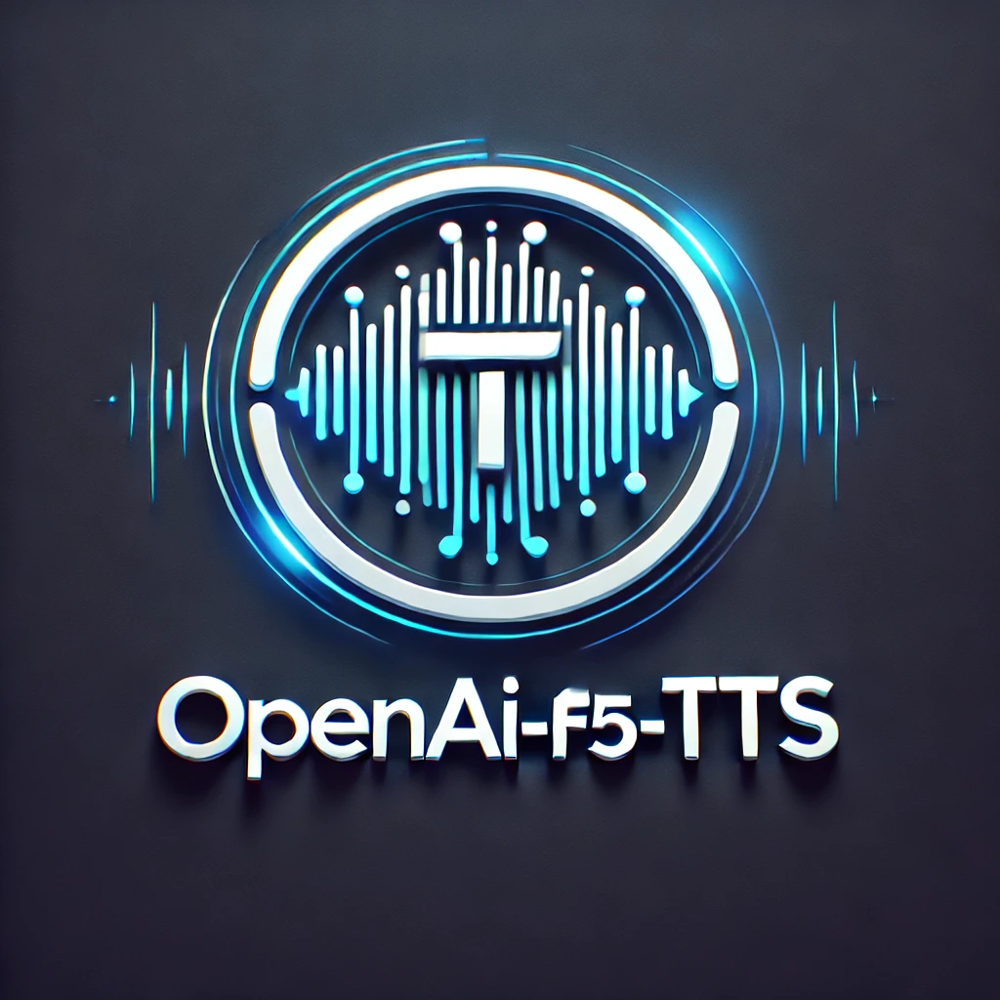

# openai-f5-tts



Welcome to **openai-f5-tts**! This project provides a user-friendly Flask-based API for generating high-quality text-to-speech (TTS) audio using **F5-TTS**, a flexible and powerful TTS engine. The API supports customizable voices, including the default voice **Emilia**, and allows for easy integration into applications requiring speech synthesis.

---

## Table of Contents

- [Prerequisites](#prerequisites)
- [Deployment Instructions](#deployment-instructions)
  - [Using Docker Compose (Recommended for Deployment)](#using-docker-compose-recommended-for-deployment)
- [Development Setup](#development-setup)
  - [Prerequisites](#prerequisites-1)
  - [Installation Steps](#installation-steps)
- [API Endpoints](#api-endpoints)
- [Adding Your Own Fine-Tuned Checkpoint](#adding-your-own-fine-tuned-checkpoint)
- [TODO](#todo)
- [Support](#support)
- [Contributing](#contributing)
- [License](#license)

---

## Prerequisites

Before getting started, ensure you have the following installed on your system:

- **Git**: For cloning the repository.
- **Docker**: Required for Docker deployment.
  - **Linux Users**: Tested with `docker.io` on Ubuntu 24.04 LTS.
  - **Windows Users**: Tested with Docker Desktop on Windows 11 (using WSL2 backend).
- **Python 3.10**: Required for development setup.
- **Conda** (optional but recommended for creating an isolated Python environment).

---

## Deployment Instructions

### Using Docker Compose (Recommended for Deployment)

This method simplifies deployment by encapsulating the entire application, including dependencies, into a Docker container.

**Step 1: Ensure Docker is Installed**

Make sure Docker is installed on your system. You can download Docker from [Docker's official website](https://www.docker.com/get-started).

**Step 2: Clone the Repository**

```bash
git clone https://github.com/matthewhand/openai-f5-tts
cd openai-f5-tts
```

*Note: Cloning the repository may take a few minutes or longer depending on your internet connection.*

**Step 3: Download Required Voice Models**

Ensure you have downloaded the necessary voice models and reference audio file:

- **Linux/macOS:**

  ```bash
  mkdir -p ckpts/Emilia
  git clone https://huggingface.co/SWivid/F5-TTS
  mv F5-TTS/F5TTS_Base/* ckpts/Emilia/

  mkdir -p ref_audio
  curl -L -o ref_audio/Emilia.wav https://github.com/SWivid/F5-TTS/raw/refs/heads/main/src/f5_tts/infer/examples/basic/basic_ref_en.wav
  ```

- **Windows (Command Prompt/PowerShell):**

  ```powershell
  mkdir ckpts\Emilia
  git clone https://huggingface.co/SWivid/F5-TTS
  move F5-TTS\F5TTS_Base\* ckpts\Emilia\

  mkdir ref_audio
  curl.exe -L -o ref_audio\Emilia.wav https://github.com/SWivid/F5-TTS/raw/refs/heads/main/src/f5_tts/infer/examples/basic/basic_ref_en.wav
  ```

*Note:* Cloning the F5-TTS repository may take a few minutes or longer depending on your internet connection.

**Step 4: Set Up Environment Variables**

Copy `.env.example` to `.env` and update it as needed:

- **Linux/macOS:**

  ```bash
  cp .env.example .env
  ```

- **Windows (Command Prompt):**

  ```cmd
  copy .env.example .env
  ```

- **Windows (PowerShell):**

  ```powershell
  copy .env.example .env
  ```

**Key Environment Variables:**

- `API_KEY`: Set this to secure API access.
- `PORT`: The port for the Flask server (default is `9090`).
- `REQUIRE_API_KEY`: Set to `True` to enforce API key authentication.
- `DEFAULT_VOICE`: Default voice name (e.g., "Emilia").
- `DEFAULT_RESPONSE_FORMAT`: Output audio format (e.g., `mp3`).

**Step 5: Run the Application**

Use Docker Compose to build and start the service:

```bash
docker-compose up --build -d
```

*This command may take several minutes to complete, especially the first time as Docker downloads the necessary images.*

**Step 6: Access the API**

The API will be available at `http://localhost:9090` by default.

**Step 7: Manage the Service**

- **Stop the service:**

  ```bash
  docker-compose down
  ```

- **Restart the service:**

  ```bash
  docker-compose up -d
  ```

**Step 8: Confirm Service is Operational**

Use `curl` to verify that the service is running correctly and that the "Emilia" voice model is available:

```bash
curl http://localhost:9090/v1/models
```

You should see a response listing the "Emilia" voice model.

---

## Development Setup

If you are developing or contributing to this project, the following method allows for a more flexible setup.

### Prerequisites

- **Python 3.10**: Ensure Python 3.10 is installed on your system.
- **Conda** (recommended) or `venv` for creating an isolated Python environment.

*Note for Windows Users:* If `conda` commands are unavailable, install [Anaconda](https://www.anaconda.com/products/distribution) and use the Anaconda Prompt or Anaconda PowerShell.

### Installation Steps

**Step 1: Clone the Repository**

```bash
git clone https://github.com/matthewhand/openai-f5-tts
cd openai-f5-tts
```

*Note: Cloning the repository may take a few minutes or longer depending on your internet connection.*

**Step 2: Download Required Voice Models**

Ensure you have downloaded the necessary voice models and reference audio file:

- **Linux/macOS:**

  ```bash
  mkdir -p ckpts/Emilia
  git clone https://huggingface.co/SWivid/F5-TTS
  mv F5-TTS/F5TTS_Base/* ckpts/Emilia/

  mkdir -p ref_audio
  curl -L -o ref_audio/Emilia.wav https://github.com/SWivid/F5-TTS/raw/refs/heads/main/src/f5_tts/infer/examples/basic/basic_ref_en.wav
  ```

- **Windows (Command Prompt/PowerShell):**

  ```powershell
  mkdir ckpts\Emilia
  git clone https://huggingface.co/SWivid/F5-TTS
  move F5-TTS\F5TTS_Base\* ckpts\Emilia\

  mkdir ref_audio
  curl.exe -L -o ref_audio\Emilia.wav https://github.com/SWivid/F5-TTS/raw/refs/heads/main/src/f5_tts/infer/examples/basic/basic_ref_en.wav
  ```

*Note:* Cloning the F5-TTS repository may take a few minutes or longer depending on your internet connection.

**Step 3: Create a Python Environment**

Set up a Python 3.10 environment using Conda or virtual environments:

- **Using Conda:**

  ```bash
  conda create -n f5-tts python=3.10
  conda activate f5-tts
  ```

  *Note for Windows Users:* If `conda` commands are unavailable, install [Anaconda](https://www.anaconda.com/products/distribution) and use the Anaconda Prompt or Anaconda PowerShell.

- **Using `venv`:**

  ```bash
  python3.10 -m venv f5-tts
  source f5-tts/bin/activate  # On Windows: f5-tts\Scripts\activate
  ```

**Step 4: Install PyTorch and Torchaudio**

Install PyTorch and Torchaudio with CUDA support (adjust for your CUDA version if necessary):

```bash
pip install torch==2.3.0+cu118 torchaudio==2.3.0+cu118 --extra-index-url https://download.pytorch.org/whl/cu118
```

*Note:* Ensure your system has the appropriate CUDA version installed for GPU acceleration. If you do not have CUDA, you can install the CPU-only versions:

```bash
pip install torch==2.3.0+cpu torchaudio==2.3.0+cpu --extra-index-url https://download.pytorch.org/whl/cpu
```

**Step 5: Install Project Dependencies**

Install the required Python packages:

```bash
pip install -r requirements.txt
```

**Step 6: Set Up Environment Variables**

Copy `.env.example` to `.env` and update the variables as needed:

- **Linux/macOS:**

  ```bash
  cp .env.example .env
  ```

- **Windows (Command Prompt/PowerShell):**

  ```cmd
  copy .env.example .env
  ```

**Step 7: Run the Application**

Start the Flask server locally:

```bash
python app/server.py
```

The API will be accessible at `http://localhost:9090`.

---

## API Endpoints

### `/v1/audio/speech`

Primary route for generating speech from text input. Requires an API key in the request header as a Bearer token.

- **URL**: `/v1/audio/speech`
- **Method**: `POST`
- **Headers**: `Authorization: Bearer <API_KEY>`
- **Data (JSON)**:
  - `input` (string): The text to convert to speech.
  - `voice` (string, optional): Voice model to use (default: "Emilia").
  - `response_format` (string, optional): Output audio format (default: `mp3`).
  - `speed` (float, optional): Speech speed adjustment factor.
  - `ref_audio` (string, optional): Path to a reference audio file.

- **Response**: An audio file in the specified format.

**Example:**

```bash
curl -X POST http://localhost:9090/v1/audio/speech \
     -H "Authorization: Bearer <API_KEY>" \
     -H "Content-Type: application/json" \
     -d '{
           "input": "Hello world",
           "voice": "Emilia",
           "response_format": "mp3",
           "speed": 1.0
         }' > output.mp3
```

### `/v1/models`

Lists available TTS models.

- **URL**: `/v1/models`
- **Method**: `GET`
- **Headers**: `Authorization: Bearer <API_KEY>`
- **Response**: JSON containing the available models.

### `/v1/voices`

Lists available voices, with optional language filtering.

- **URL**: `/v1/voices`
- **Method**: `GET`
- **Headers**: `Authorization: Bearer <API_KEY>`
- **Parameters**:
  - `language` or `locale` (optional): Language filter for voices.
- **Response**: JSON containing the available voices.

### `/v1/voices/all`

Lists all supported voices, regardless of language.

- **URL**: `/v1/voices/all`
- **Method**: `GET`
- **Headers**: `Authorization: Bearer <API_KEY>`
- **Response**: JSON containing all supported voices.

---

## Adding Your Own Fine-Tuned Checkpoint

Enhance the TTS system by adding your own fine-tuned voice model. Follow these steps:

**Step 1: Create a Directory for Your Voice Model**

- **Linux/macOS:**

  ```bash
  mkdir -p ckpts/MyVoice
  ```

- **Windows (Command Prompt/PowerShell):**

  ```powershell
  mkdir ckpts\MyVoice
  ```

**Step 2: Add the Model File**

Place the `model_1200000.pt` file from your fine-tuning into the new folder:

- **Linux/macOS:**

  ```bash
  mv path_to_your_checkpoint/model_1200000.pt ckpts/MyVoice/
  ```

- **Windows (Command Prompt/PowerShell):**

  ```powershell
  move path_to_your_checkpoint\model_1200000.pt ckpts\MyVoice\
  ```

**Step 3: Add Reference Audio**

Add a reference audio file in the `ref_audio/` directory:

- **Linux/macOS:**

  ```bash
  mv path_to_ref_audio/MyVoice.wav ref_audio/
  ```

- **Windows (Command Prompt/PowerShell):**

  ```powershell
  move path_to_ref_audio\MyVoice.wav ref_audio\
  ```

**Step 4: First Run**

The `.pt` file will automatically be converted to `.safetensors` on the first run for efficiency.

**Step 5: Use the New Voice**

Specify your new voice in API calls:

```bash
curl -X POST http://localhost:9090/v1/audio/speech \
     -H "Authorization: Bearer <API_KEY>" \
     -H "Content-Type: application/json" \
     -d '{
           "input": "Hello world",
           "voice": "MyVoice",
           "response_format": "mp3",
           "speed": 1.0
         }' > output.mp3
```

---

## TODO

- [x] Expose OpenAI-compatible endpoint
- [x] Fix Docker + CUDA compatibility
- [x] Multiple voice models
- [ ] Add expression parsing for nuanced speech
- [ ] Document usage for fine-tuned models
- [ ] Enhance error handling and logging

---

## Support

If you encounter any issues or have questions, feel free to open an issue on the [GitHub repository](https://github.com/matthewhand/openai-f5-tts).

---

## Contributing

We welcome contributions! Please read our [Contributing Guidelines](CONTRIBUTING.md) before getting started.

---

## License

This project is licensed under the [MIT License](LICENSE).

---

Thank you for using **openai-f5-tts**! We hope it helps bring your projects to life with natural and customizable speech synthesis.
